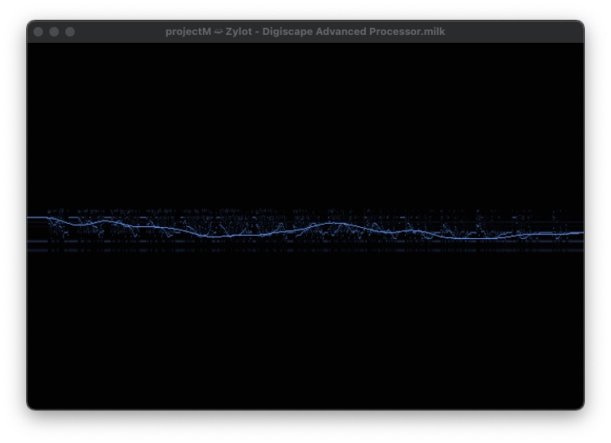

# Using projectM Milkdrop audio visualizer (projectMSDL standalone) 

##Windows
   in progress
     

##macOS (tested on macOS Monterey 12.4 on Apple Silicon)

### Compile libprojectM
1. First, build and install libprojectM  (or install from brew?, ensure you have brew installed).   
   a. Download libprojectM zip and extract to folder      
   b. cd projectm-master   
	    mkdir cmake-build
	    cd cmake-build   
	    cmake -DCMAKE_BUILD_TYPE=Release ..   
	    make && sudo make install   

### Compile projectMSDL (sdl interface for projectM)
1. Download frontend-sdl2-master zip and extract to folder
2. Ensure you have dependencies   
   a. brew install sdl2 # macOS 
3. cd frontend-sdl2-master
4. It was missing something called Poco. So, install by doing: ‘brew install Poco’
5. mkdir build   
    cd build   
    cmake ..   
    make   

### Setup
1. Download Milkdrop presets. (a) Provide projectMSDL a path to the folder of presets or  (b) set it in the ‘projectMSDL.properties’ file   
   a. Provide path   
	   ./projectMSDL —presets /path/to/presets/   
	    OR   
	b. Set properties file   
	    open projectMSDL.properties file in text editor   
	    if you made a preset folder called ‘presets’ in the main dir, set projectM.presetPath = \presets   
2. You may want to use a virtual audio driver such as Loopback by Rogue Amoeba or BlackHole to create passthrough sound to your system’s microphone for projectM to pickup the input.   
   BlackHole option (https://github.com/ExistentialAudio/BlackHole)   
   a. Install BlackHole-2Ch version   
   b. In macOS open the ‘Audio Midi Setup’ program.   
   c. Create a Multi-Output Device (click plus at bottom left then ‘Create Multi-Output Device’   
   d. In the new Multi-Output device, select both ‘Built-In Output (or External Headphones) & ‘Blackhole 	2ch’  (Important -> a macOS thing -> it’s important that the listening device one be at the top, fix this by unselecting them by the Use checkbox and reselect to make the output device on top.)   
   e. Right click on the Multi-Output device and select ‘Use This Device For Sound Output’.   
   f. You may find you want to increase the microphone volume to increase the sensitivity on projectM later, but projectM has it’s own beat sensitivity setting you can change with Up or Down keys on keyboard. Proceed to next step to start program.  

### Use
1. cd to the /src directory where you built projectMSDL,  projectMSDL executable should be there. Run it using ./projectMSDL.      projectMSDL should start
2. Press F1 or H for help keyboard shortcuts
3. Press n for next preset or p for prev preset
4. Press m (or ENTER) to open list of all of your presets, press enter again to select one
5. enjoy   
Does Ctrl-I select the next input device?

### References:
* https://github.com/projectM-visualizer/projectm/wiki/Building-libprojectM
* https://github.com/projectM-visualizer/frontend-sdl2
* https://github.com/ExistentialAudio/BlackHole
* https://rogueamoeba.com/loopback/
